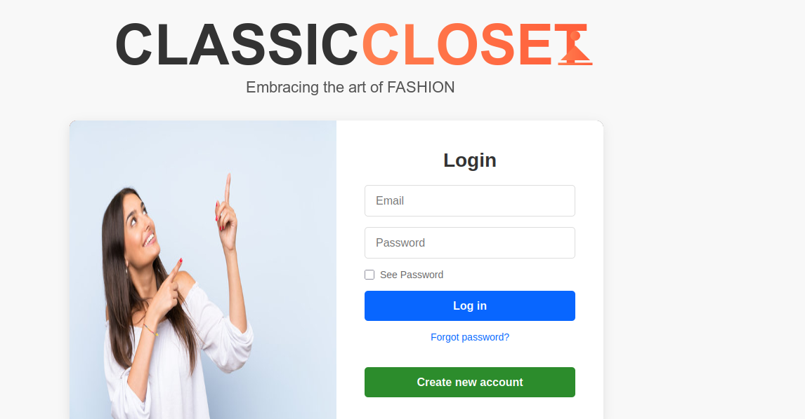
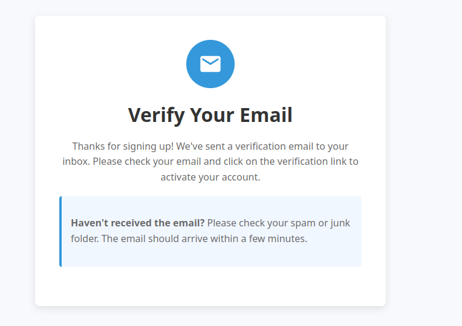
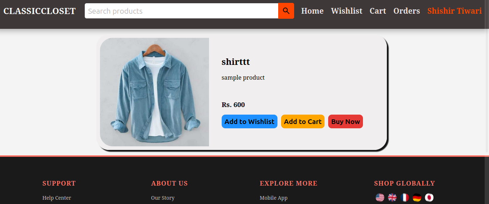
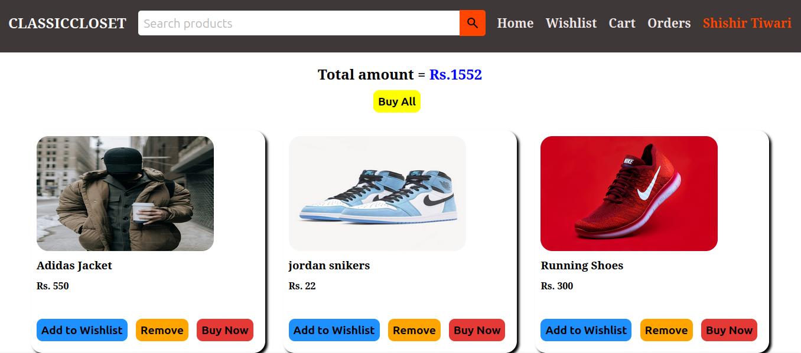
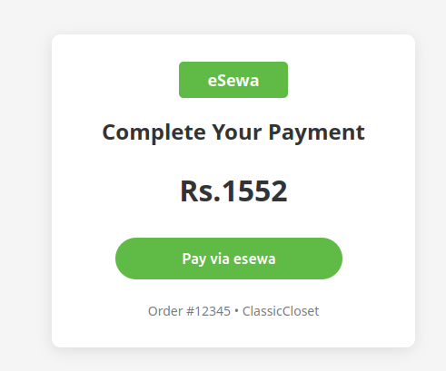
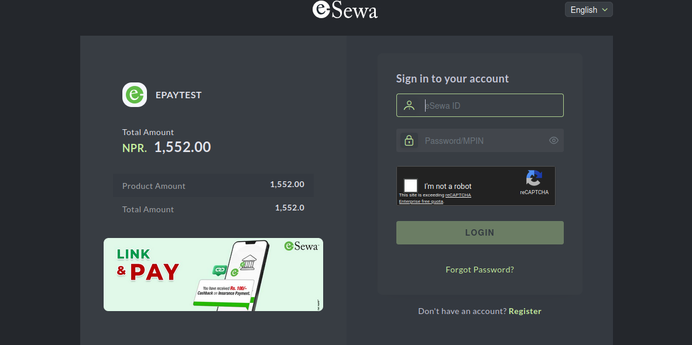
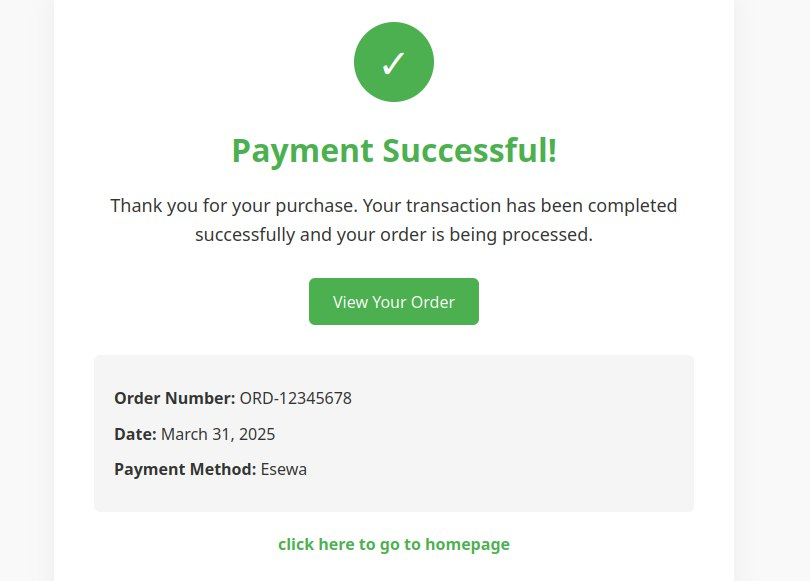
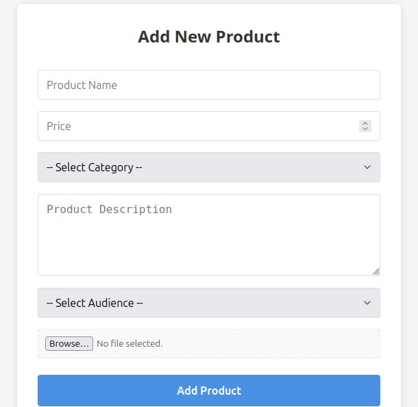
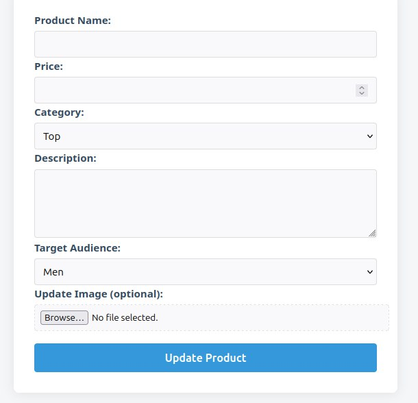

# ClassicCloset

ClassicCloset is a full-stack e-commerce web application for buying and selling fashion products. It provides a seamless shopping experience with secure authentication, product browsing, cart management, wishlist support, and an admin dashboard for managing the platform.

## ✨ Features

- 🔐 Secure user authentication & authorization
- 👕 Browse, search, and filter products
- 🛒 Shopping cart with quantity management
- ❤️ Wishlist functionality
- 💳 Secure checkout using ESEWA and order placement
- 📦 Order history and order tracking
- 📊 Admin dashboard for managing products, users, and orders
- 📱 Responsive user interface

## 🛠️ Tech Stack

### 🎨 Frontend

- EJS
- HTML5
- CSS3
- JavaScript

### ⚙️ Backend

- Node.js
- Express.js

### 🗄️ Database

- MongoDB
- Mongoose

### 🔧 Tools & Libraries

- Passport.js
- Express Session
- bcrypt.js
- Multer
- nodemailer

## 📸 Screenshots

<table>
  <tr>
    <td align="center">
      <strong>🔐 Login Page</strong>  
      
    </td>
    <td align="center">
      <strong>📧 Verify Email</strong>  
      
    </td>
  </tr>

  <tr>
    <td align="center">
      <strong>🔑 Forgot Password</strong>  
      
    </td>
    <td align="center">
      <strong>🏠 Home Page</strong>  
      
    </td>
  </tr>

  <tr>
    <td align="center">
      <strong>👕 Product Description</strong>  
      
    </td>
    <td align="center">
      <strong>🛒 Shopping Cart</strong>  
      
    </td>
  </tr>

  <tr>
    <td align="center">
      <strong>💳 Payment Information</strong>  
      
    </td>
    <td align="center">
      <strong>💰 eSewa Payment Interface</strong>  
      
    </td>
  </tr>

  <tr>
    <td align="center">
      <strong>✅ Successful Payment</strong>  
      
    </td>
    <td align="center">
      <strong>➕ Admin - Add Product</strong>  
      
    </td>
  </tr>

  <tr>
    <td colspan="2" align="center">
      <strong>✏️ Admin - Update Product</strong>  
      
    </td>
  </tr>
</table>
